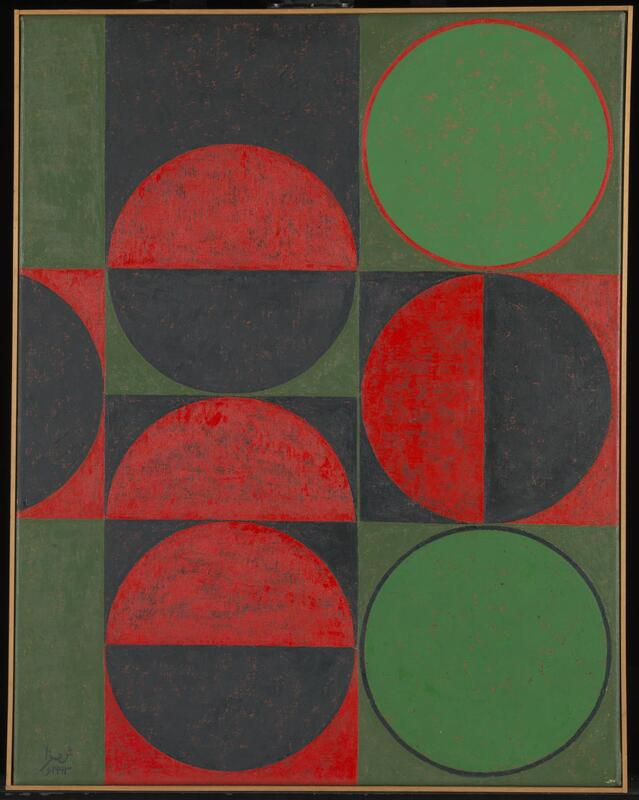
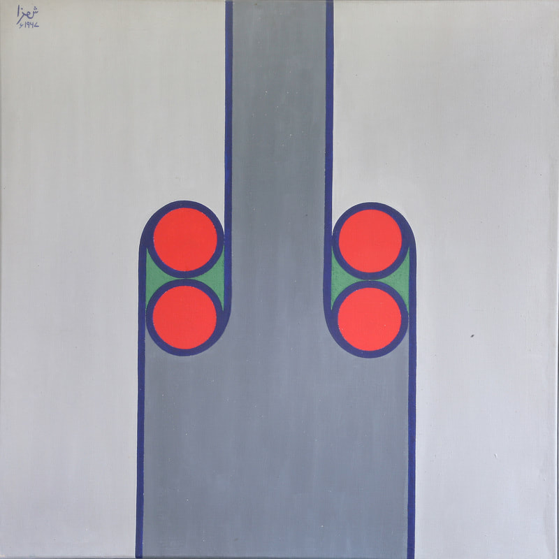
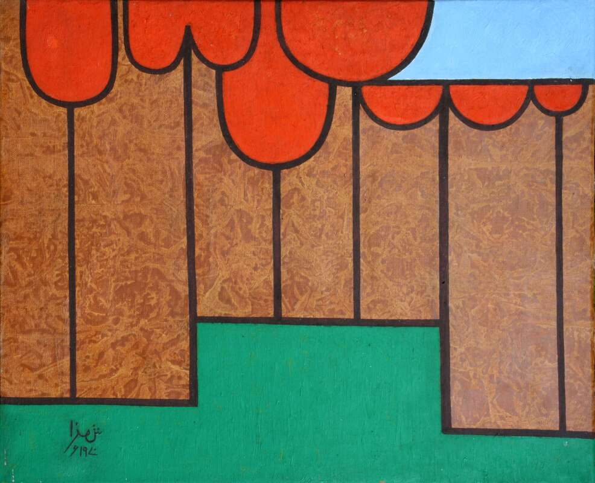
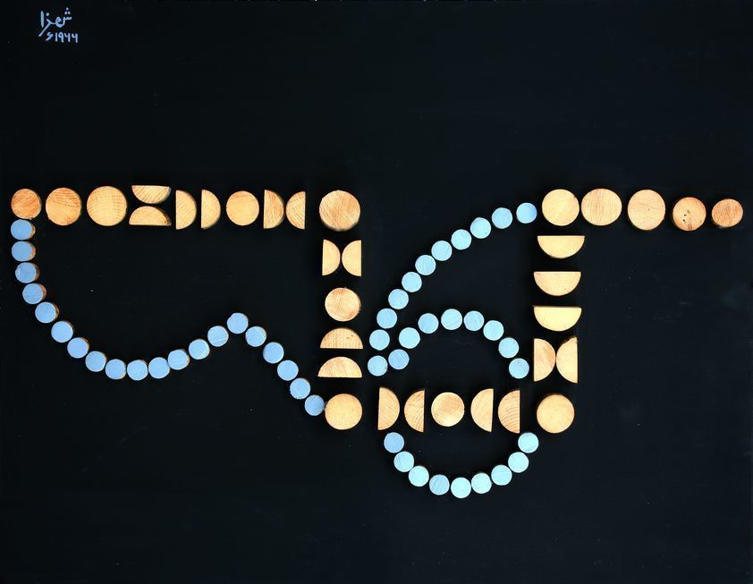

# IDEA9103-Tut-1--Russian--Group-E

## Section 1: Research and Inspiration
The artwork that has been chosen by the group is ‘Apple Tree’ by Anwar Jalal Shemza. ‘Apple Tree was created in 1962, in this piece Shemza explored organic themes and its repeating nature. This is seen in Shemza’s use of repetitive circular and linear patterns which are used to represent the structure of a common tree. Through this Shemza has created a sense of rhythm and balance which is experienced in nature.

This artwork is shown b:

Shemza took strong inspiration from the Biblical Genesis story of the Garden of Eden. The tree in his artwork thus represents the Tree of Knowledge which Eve takes the forbidden fruit from. This represents the two sides of the human experience, one being the pursuit of knowledge and the freedom which it can give and its potential downfall. This is represented in the fruit being two colours, one which represents the calmness and security which was offered by God and the other symbolising the downfall which the Devil offered to the couple.
The same characteristics also shown in other artworks by Anwar such as: 

These same characteristics of repetition of linear and circular patterns is also seen in his other works. These works are shown below:

##### Composition in Red and Green, 1963.

##### Meem Two 1967.

##### Apple Trees, 1970.

##### Composition with a Number Six, 1966

The reason that Apple Tree has been chosen by the group is because it can be created in the same method with JavaScript and specifically p5.js, which leads itself to use simple geometric shapes to create natural artworks like what Shemza has created. This has inspired the group to follow a similar structure by using simple geometric shapes, such as lines and circles, to create nature-based artworks in code. Also, this concept helps the group understand how to use JavaScript to generate the structural layout of branches and leaves observed in Shemza's work. Similarly, we will use the concept of generative art to repeat the lines of branches and leaves to build the complexity of the work. Moreover, the nature elements such as trees has a potential of growth, allowing the opportunity to create the iteration of the form of our individual works.Moreover, the nature elements such as trees has a potential of growth, allowing the opportunity to create the iteration of the form of our individual works.

Inspiration for the final piece can be shown in the links below. These pieces of artwork show the growth of a tree which has given us inspiration to use moving featuring in our work to make the final piece movement. This will give the effect of making the final piece to feel active and alive.

[Link to Precedents1](https://openprocessing.org/sketch/2225948)

[Link to Precedents2](https://openprocessing.org/sketch/138954)

[Link to Image and artworks information](https://www.anwarshemza.com/publiccollections1.html)

## Section 2: Technical Planning
To be able to recreate Shemza's ‘Apple Tree’ using p5.js it is planned to segregate the code into distinct sections which will allow for more succinct writing and reading of the entire script. The code will be split into three main sections:
•	drawTree
•	drawCircles
•	drawBaseStructure

Within these three sections of the code there will be nested functions which will allow for the group to be able to complete each of the sections with ease. drawTree will include two functions which will use for loops which will draw the branches of the tree. Due to there being both vertical and horizontal lines it is will be more convenient for the drawTree section to be split into these two sections. For the branches to grow and shrink with the size of the window the windowResize function will need to be used here.

The next section is the drawCircles which will be used to draw semicircles using the built in arc function. These semicircles will represent the fruits which Shemza similarly used in his artwork. Within this section for loops will also be used to easily draw said semicircles. Using for loops will also make it simpler to have these semicircles grow and shrink and the window is resized. For this the windowResize function will also need to be used here.

The final section will be the drawBaseStructure which will be used to draw the base which the tree will be placed on. This will be drawn in two parts, one being a rectangle using the rect function and the second being the array of semicircles which are included in the base. The rectangle will be simple; however, the semicircles will be drawn with a for loop. Similarly, to the other sections this whole section will need to grow and shrink with the size of the window so the windowResize function will be implemented here.

## Section 3: Implementation
"Show iterations of your process to achieve the outcome. This should include some screen shots of outputs of different stages of your work. If your group’s design wasn't fully realised in code, still showcase your intentions as well as the results you were able to achieve and iterations to get there. Highlight how you were or weren’t able to able to stick to your planning in section 1."

## Section 4: Technical Overview
"Create a comprehensive overview of how your final group code works. This should contain code snippets (screenshots of code or text), along with explanations of each. You can also create an overall flowchart or visual map showing the major sections of your code and how they relate to each other."